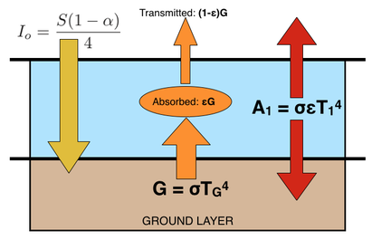

---
jupytext:
  cell_metadata_filter: all
  encoding: '# -*- coding: utf-8 -*-'
  formats: ipynb,py:percent,md:myst
  notebook_metadata_filter: all,-language_info,-toc,-latex_envs
  text_representation:
    extension: .md
    format_name: myst
    format_version: 0.12
    jupytext_version: 1.9.1
kernelspec:
  display_name: Python 3
  language: python
  name: python3
latex_metadata:
  chead: E340 Day 5
  lhead: Quiz solutions
---

1.  Suppose we have a one layer atmosphere with ε=1 above a black
    surface as in Dessler Fig. 4.6 or the one layer model on page 3 of the Day 5 reading. 
    Does adding a second opaque (ε=1)
    layer (Dessler Figure 4.7 or the two layer model on page 4) increase the greenhouse effect, decrease
    the greenhouse effect, or leave the greenhouse effect unchanged?
    
    A.  increase  
    B.  decrease  
    C.  no change  

2.  Suppose a planet's average surface temperature is about $T_g$ = 350 K. In the one-layer
    semi-transparent atmosphere shown below (and seen in your reading),
    what would the approximate long-wave atmospheric emissivity ε need to be 
    to maintain value of $T_g$, if the average shorwave flux was $I_0=500\ W\,m^{-2}$. (Hint, look at equations 5-6 in the reading).

    A.  0.54  
    B.  0.61  
    C.  0.77  
    D.  0.82  
    E.  0.93

   

3\. Given a one-layer atmosphere like problem 2, but with $\epsilon=0.8$, $T_G$=300 K, $T_1$=265 K, $I_0$ = 300 $W\,m^{-2}$,  calculate the greenouse effect. (choose the closest number)

   A. -130 $W\,m^2$  
   B. +10  $W\,m^2$  
   C. +110 $W\,m^2$  
   D. +140 $W\,m^2$  
   E. +180 $W\,m^2$

4\. According to the figure below, how big is the Earth's greenhouse effect?
 
   A.  85 $W\,m^{-2}$  
   B. 157 $W\,m^{-2}$  
   C. 254 $W\,m^{-2}$  
   D. 285 $W\,m^{-2}$  
   E. 333 $W\,m^{-2}$  

   

